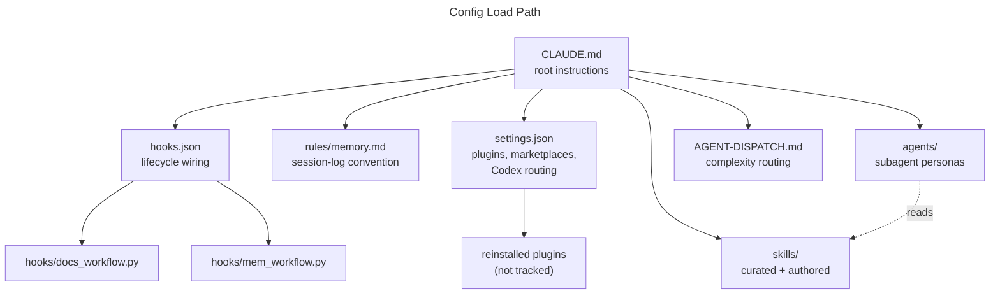

# global-claude-101

> Personal global config for [Claude Code](https://claude.com/claude-code) — the root
> `CLAUDE.md`, custom skills, agent definitions, hooks, and routing rules that apply to
> every project on this machine — version-controlled so they survive a laptop switch
> instead of living as loose files nobody backs up.

## Why this exists

`~/.claude/` on local disk is a single point of failure. It doesn't survive a machine
switch, a reinstall, or a stray `rm` — and it did fail, once: `AGENT-DISPATCH.md` (the
agent-routing guide tracked below) was deleted mid-session with zero backup anywhere on
disk, and had to be reconstructed from a README that only described it secondhand.

That's the whole reason this repo exists. Every file here now has history, every change
is a reviewable diff on `dev` before it reaches `main`, and nothing gets permanently lost
to one bad command again.

## Table of contents

- [How it fits together](#how-it-fits-together)
- [What's in here](#whats-in-here)
- [Repository structure](#repository-structure)
- [External skills](#external-skills-not-in-this-repo)
- [What's deliberately excluded](#whats-deliberately-excluded)
- [Setup on a new machine](#setup-on-a-new-machine)
- [License](#license)

## How it fits together



Session start reads `CLAUDE.md`, which pulls in the rest: hooks enforce the
session-memory and docs conventions on every prompt/tool call, `settings.json` declares
which plugins to reinstall, and `skills/` + `agents/` supply the custom personas and
routing guidance layered on top of stock Claude Code.

## What's in here

| Path | Purpose |
| --- | --- |
| `CLAUDE.md` | Root global instructions loaded into every Claude Code session |
| `AGENT-DISPATCH.md` | Task-routing / complexity-scoring guide — when to go direct vs. subagent vs. Codex subprocess |
| `rules/memory.md` | Session-memory convention (`/mem/YYYYMMDD-{task-slug}.md` logs) |
| `docs/README.md` | Convention for per-feature reference docs under `docs/` |
| `hooks/` | Docs-workflow and memory-workflow automation scripts, wired via `hooks.json` |
| `hooks.json` | Hook wiring — which scripts run on which Claude Code lifecycle event |
| `agents/` | Custom subagent definitions (`scrum-master`, `senior-tech-lead`, `system-design`) |
| `skills/` | Curated and self-authored skills (see [External skills](#external-skills-not-in-this-repo) for what's excluded) |
| `settings.json` | Enabled plugins, marketplaces, Codex subprocess config, routing thresholds |
| `keybindings.json` | Custom keyboard shortcuts |
| `skills-lock.json` | Lockfile for externally-sourced skills |
| `statusline-command.sh` / `statusline-debug.sh` | Status line scripts |

## Repository structure

```text
.
├── CLAUDE.md
├── AGENT-DISPATCH.md
├── settings.json
├── keybindings.json
├── skills-lock.json
├── hooks.json
├── statusline-command.sh
├── statusline-debug.sh
├── rules/
│   └── memory.md
├── docs/
│   └── README.md
├── hooks/
│   ├── docs_workflow.py
│   ├── mem_workflow.py
│   └── *.ps1 / *.md
├── agents/
│   ├── scrum-master.md
│   ├── senior-tech-lead.md
│   └── system-design.md
└── skills/
    ├── claude-md/
    ├── code-review-workflow/
    ├── content-strategist/
    ├── docs-audit/
    ├── readme-writer/
    ├── scrum-master/ (+ scrum-master.md)
    ├── senior-tech-lead/ (+ senior-tech-lead.md)
    ├── system-design/ (+ system-design.md)
    └── ui-ux-pro-max/
```

## External skills (not in this repo)

Some skills in `~/.claude/skills/` came from somewhere else and aren't tracked here —
they reinstall on their own, or need one manual step after cloning:

| Skill | Source | How to get it |
| --- | --- | --- |
| `hallmark` | Plugin: `hallmark@claude-code-skills` (`skills-lock.json` pins it to `nutlope/hallmark`) | Reinstalls automatically from `settings.json` → `enabledPlugins` — nothing manual. |
| `llm-council` | Standalone repo: `tenfoldmarc/llm-council-skill` | Not a plugin — clone it directly: `git clone https://github.com/tenfoldmarc/llm-council-skill.git skills/llm-council` |
| `use-railway` | Railway's own vendor skill, bundled with the Railway MCP integration | Reinstalls with the Railway MCP server — no manual step. |

> [!NOTE]
> `ui-ux-pro-max` also originates externally
> ([`nextlevelbuilder/ui-ux-pro-max-skill`](https://github.com/nextlevelbuilder/ui-ux-pro-max-skill),
> also installable via `/plugin marketplace add nextlevelbuilder/ui-ux-pro-max-skill` +
> `/plugin install ui-ux-pro-max@ui-ux`) but is kept here in full and modified freely
> rather than tracked as an external dependency.

## What's deliberately excluded

- **Secrets**: `.credentials.json`
- **Session history**: `history.jsonl`, `sessions/`, `projects/`
- **Caches**: `paste-cache/`, `image-cache/`, `cache/`, `plugins/cache/`
- **Per-task logs**: `mem/` — useful locally, not meant to travel
- **Reinstallable plugin payloads**: `plugins/` (97MB+ of cached plugin code) — fully
  specified by `settings.json` → `enabledPlugins` and `extraKnownMarketplaces`, so it's
  redundant to track
- **Build junk**: `__pycache__/`, `*.pyc`
- Any other machine-specific or secret runtime state

This repo is portable config, not a full backup of runtime state.

## Setup on a new machine

1. Install Claude Code, let it create `~/.claude/`.
2. Clone this repo's tracked files into `~/.claude/` (or symlink individual files in).
3. Launch Claude Code — plugins listed in `settings.json` → `enabledPlugins` reinstall
   automatically.
4. Clone `llm-council` manually (it's not a plugin, so step 3 won't cover it):

   ```bash
   git clone https://github.com/tenfoldmarc/llm-council-skill.git skills/llm-council
   ```

## License

Personal configuration — not published under an open-source license. Feel free to read
it for ideas; it's not intended for reuse as a dependency.
