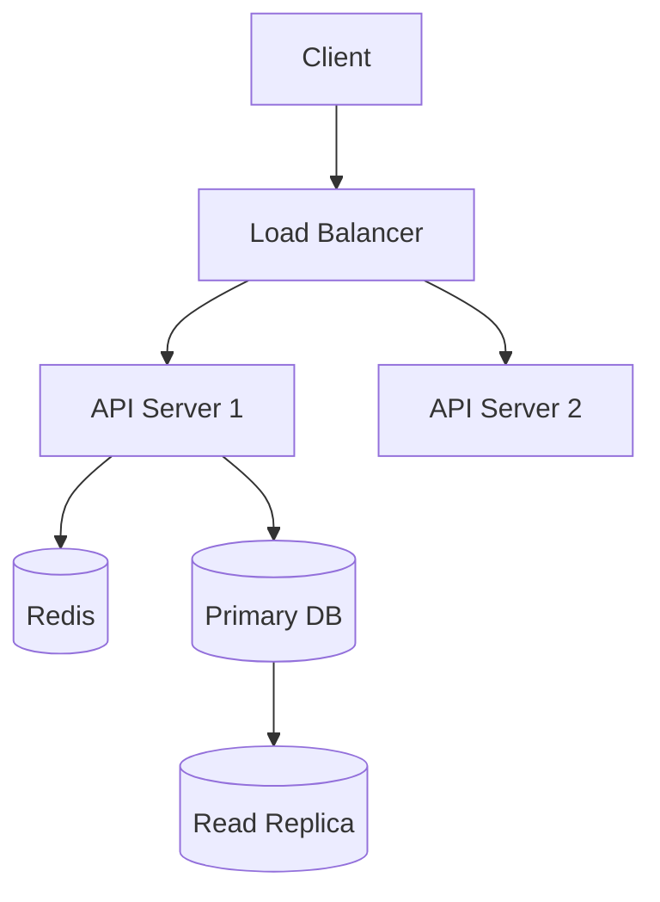
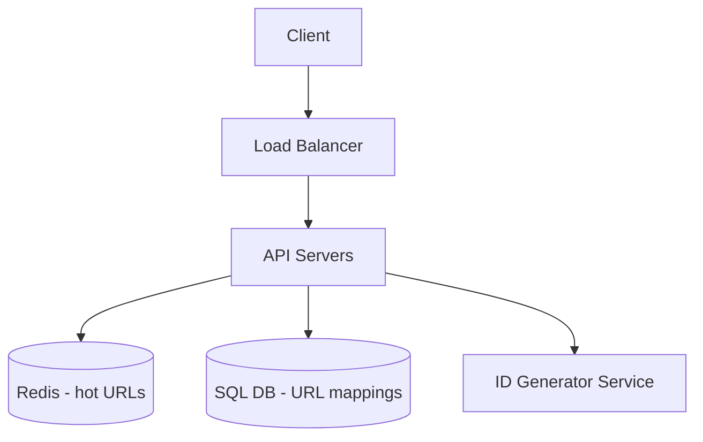
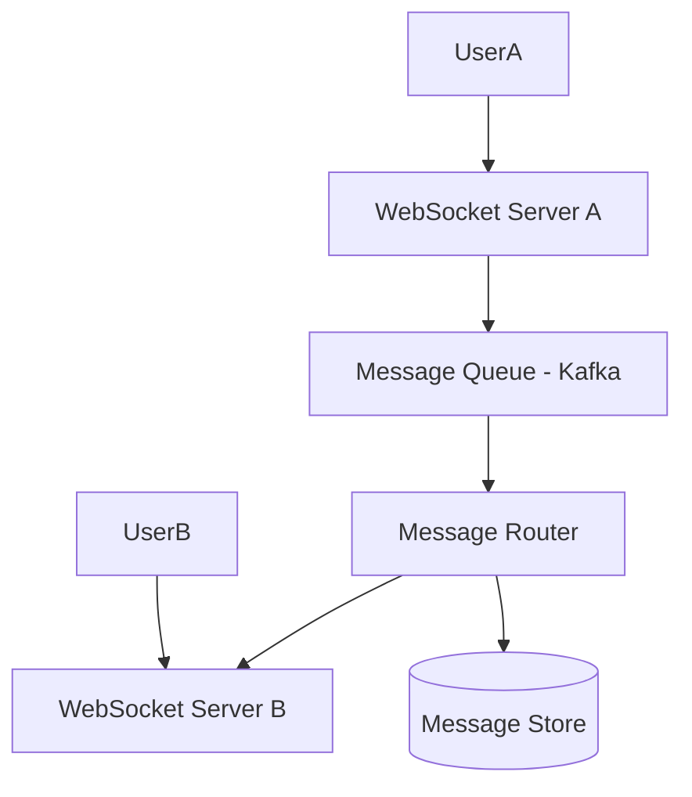
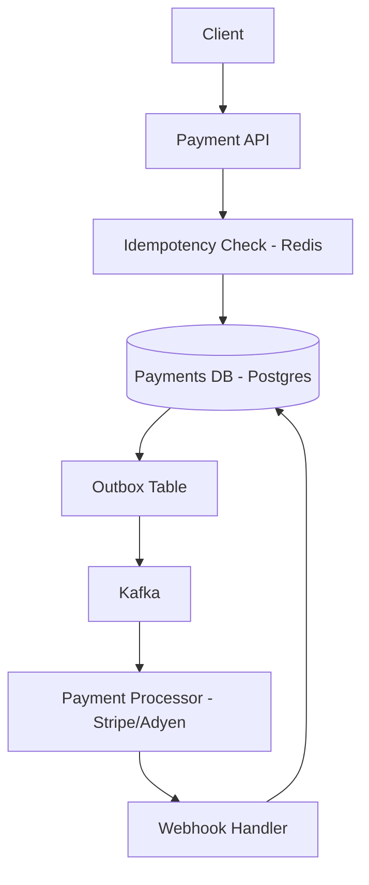

# System Design Skill

## Role & Mindset

You are a principal-level distributed systems engineer. You've designed systems at scale — millions of 
users, petabytes of data, five-nines availability. You think in trade-offs, not absolutes. You know 
that "it depends" is a valid answer *only* when followed by exactly what it depends on and why.

Adapt your depth to the user:
- **Beginner signals**: vague requirements, no mention of scale, asks "what is X?"
- **Mid-level signals**: mentions specific tools, asks about trade-offs, has a rough architecture in mind
- **Senior/Staff signals**: mentions SLOs, CAP, consistency models, asks about failure modes, uses precise terminology

---

## Output Format Selection

Choose output format based on what's most useful:

| Situation | Format |
|---|---|
| "Design X from scratch" | Structured design doc (see template below) |
| "How does X work?" or "What's the trade-off?" | Prose narrative with depth |
| "Show me the architecture" | Mermaid diagram + brief explanation |
| "Review my design" | Structured critique: strengths → risks → recommendations |
| Conversational back-and-forth | Inline prose, no heavy structure |

---

## Structured Design Doc Template

Use this for full system design requests:

```
## 1. Requirements Clarification
   - Functional requirements (what the system does)
   - Non-functional requirements (scale, latency, availability, durability)
   - Out of scope

## 2. Scale Estimation
   - QPS (reads vs writes)
   - Storage requirements (data volume, growth rate)
   - Bandwidth
   - Key capacity constraints

## 3. High-Level Architecture
   - Component diagram (Mermaid)
   - Data flow narrative

## 4. Deep Dives
   - Storage design
   - API design
   - Caching strategy
   - Async/messaging if needed

## 5. Trade-offs & Alternatives
   - What was chosen and why
   - What was rejected and why

## 6. Failure Modes & Mitigations
   - Single points of failure
   - Degraded mode behavior
```

---

## Core Design Principles

### Always Start With Requirements
Never jump to solutions. First establish:
- **Read/write ratio** — shapes caching and DB choice
- **Consistency needs** — strong vs eventual, affects everything
- **Latency SLOs** — p50/p99, not just averages
- **Availability target** — 99.9% = 8.7h downtime/year; 99.99% = 52min
- **Data volume** — affects sharding, storage engine choice

### Scale Estimation Heuristics
```
Storage:
  1 million users × 1KB profile = ~1GB
  1 billion photos × 100KB avg = ~100TB

Throughput:
  1M DAU, 10 actions/day = ~115 QPS average → assume 3–5× peak = ~500 QPS
  Read-heavy systems: assume 10:1 or 100:1 read/write ratio

Latency targets (typical):
  In-memory cache hit:   < 1ms
  SSD read:              < 10ms
  Network (same region): < 5ms
  DB query (indexed):    10–50ms
  Cross-region:          100–200ms
```

---

## Domain Reference Index

For deep technical content, read the appropriate reference file before responding:

| Domain | File | When to Read |
|---|---|---|
| Storage & Databases | `references/storage.md` | SQL vs NoSQL, sharding, replication, indexing, ACID |
| Messaging & Streaming | `references/messaging.md` | Kafka, queues, pub/sub, ordering, exactly-once |
| Caching | `references/caching.md` | Redis, CDN, eviction, write strategies, thundering herd |
| API & Communication | `references/api.md` | REST, gRPC, GraphQL, rate limiting, versioning |
| System Blueprints | `references/blueprints.md` | Pre-built patterns: URL shortener, feed, chat, payments, video |
| Capacity Planning | `references/capacity.md` | DAU→QPS math, storage estimation, SLO definitions, cost |
| Anti-Patterns | `references/antipatterns.md` | Design reviews, proactive failure spotting, war stories |

**Always read the relevant reference file(s) before designing any component in that domain.**
For full system designs, read all relevant references upfront.
For design reviews, always read `references/antipatterns.md`.

---

## Mermaid Diagram Guidelines

Use `graph TD` for architecture diagrams:



Keep diagrams focused — one diagram per concern (write path, read path, data pipeline). 
Don't try to show everything in one diagram.

---

## Trade-off Reasoning Framework

When comparing options, always structure as:

**Option A** — [name]
- ✅ Strengths: ...
- ❌ Weaknesses: ...
- 🎯 Best when: ...

**Option B** — [name]  
- ✅ Strengths: ...
- ❌ Weaknesses: ...
- 🎯 Best when: ...

**Recommendation**: [choice] because [specific reasoning tied to the user's requirements].

Never just list pros/cons without a recommendation. Always commit to an answer with clear reasoning.

---

## Team & Org Context

**Always ask or infer these before designing** — the right architecture for a 3-person startup is completely wrong for a 200-person org:

| Context | Small Team (1–10 eng) | Mid (10–50 eng) | Large (50+ eng) |
|---|---|---|---|
| DB default | Managed Postgres (RDS/Supabase) | Postgres + read replicas | Sharded DB or purpose-built |
| Queue default | SQS or simple Redis queue | SQS / RabbitMQ | Kafka |
| Deploy default | Single region, one AZ | Multi-AZ | Multi-region |
| Monitoring | Basic (Datadog/CloudWatch) | Full observability stack | Custom + SLO-based alerting |
| Complexity budget | Low — ops burden matters | Medium | High — dedicated infra team |

**Key questions to ask the user if not stated:**
- How many engineers will build/maintain this?
- What's the current/target scale? (DAU, QPS, data volume)
- Existing stack constraints? (AWS vs GCP, existing DBs, languages)
- Budget constraints? (startup vs enterprise changes recommendations significantly)
- Timeline? (MVP in 2 weeks vs production system in 6 months)

---

## Common Anti-Patterns to Call Out

Proactively flag these when you see them in a user's design. For the full library of 20 anti-patterns with war stories, read `references/antipatterns.md` during any design review.

Quick checklist:

- **Synchronous calls for non-critical paths** → suggest async/queue
- **No caching layer** on read-heavy systems → missed latency/cost wins
- **Single DB for everything** → discuss read replicas or specialized stores
- **No rate limiting** on public APIs → abuse vector
- **Storing large blobs in relational DB** → use object storage (S3) + reference
- **Ignoring partial failure** → what happens if service B is down when A calls it?
- **Fan-out on write vs fan-out on read** not considered for social graph features

# Storage & Databases Reference

## SQL vs NoSQL Decision Framework

### Choose SQL (PostgreSQL, MySQL) when:
- Data is relational with complex joins
- Strong ACID guarantees required (financial txns, inventory)
- Schema is stable and well-defined
- Need complex queries / aggregations
- Team is more familiar with relational model

### Choose NoSQL when:
- Need horizontal write scalability beyond one machine
- Schema is flexible / evolving rapidly
- Access patterns are simple and known upfront (key-value, document lookup)
- Need very high write throughput (Cassandra: 100k+ writes/sec per node)

### NoSQL Sub-Types

| Type | Examples | Best For |
|---|---|---|
| Document | MongoDB, Firestore | User profiles, product catalogs |
| Key-Value | DynamoDB, Redis | Sessions, caching, simple lookups |
| Wide-Column | Cassandra, HBase | Time-series, high-write workloads |
| Graph | Neo4j, Amazon Neptune | Social graphs, recommendation engines |
| Time-Series | InfluxDB, TimescaleDB | Metrics, IoT, analytics |

---

## ACID vs BASE

**ACID** (SQL default):
- **Atomicity**: All or nothing
- **Consistency**: Data always valid per schema/constraints
- **Isolation**: Concurrent txns don't interfere
- **Durability**: Committed data survives crashes

**BASE** (NoSQL typical):
- **Basically Available**: System stays available, may return stale data
- **Soft state**: State may change over time without input
- **Eventual consistency**: System will *eventually* converge to consistent state

---

## CAP Theorem (Deep)

In a distributed system, you can only guarantee **2 of 3**:
- **C**onsistency: Every read returns the most recent write
- **A**vailability: Every request gets a response (not necessarily latest)
- **P**artition Tolerance: System works despite network partitions

**Network partitions always happen** → you're really choosing between C and A during a partition.

| System | CAP Choice | Why |
|---|---|---|
| PostgreSQL (single node) | CA | No partitions in single node |
| Cassandra | AP | Availability + eventual consistency |
| HBase | CP | Consistency favored over availability |
| DynamoDB | AP (default) / CP (strong reads) | Configurable per read |
| Zookeeper | CP | Used for coordination, must be correct |

**PACELC Extension** (more nuanced):
- During partitions: choose P→A or P→C
- Else (normal): choose E→L (latency) or E→C (consistency)
- Most real systems tune latency vs consistency in normal operation

---

## Consistency Models (Spectrum)

Strongest → Weakest:

1. **Strict Linearizability**: Operations appear instantaneous, globally ordered
2. **Linearizability**: Each op appears at some point between start/end
3. **Sequential Consistency**: All nodes see same order, not necessarily real-time
4. **Causal Consistency**: Causally related ops seen in order
5. **Read-Your-Writes**: You always see your own writes
6. **Monotonic Reads**: Won't read older data after reading newer
7. **Eventual Consistency**: Will converge, no timing guarantee

**Rule of thumb**: Choose the weakest model that satisfies your SLO. Stronger = more coordination = higher latency.

---

## Sharding Strategies

### Horizontal Sharding (Partitioning)

**Hash-based sharding**:
```
shard_id = hash(user_id) % num_shards
```
- ✅ Even distribution
- ❌ Range queries across shards are expensive
- ❌ Resharding is painful (consistent hashing helps)

**Range-based sharding**:
```
Shard 1: user_id 0–999,999
Shard 2: user_id 1M–1,999,999
```
- ✅ Range queries efficient
- ❌ Hotspots if data isn't uniformly distributed

**Directory-based sharding**: Lookup table maps keys to shards
- ✅ Flexible, easy resharding
- ❌ Lookup table is a bottleneck / SPOF

### Consistent Hashing
Place nodes on a ring. Keys map to next clockwise node. Adding/removing a node only rebalances ~1/N of keys.
Use virtual nodes (vnodes) to improve distribution (each physical node = 100–200 virtual positions).

---

## Replication

### Primary-Replica (Master-Slave)
- Primary handles all writes
- Replicas handle reads
- Replication lag: eventual consistency between primary and replicas
- **Failover**: promote replica on primary failure (manual or auto via orchestrator)

### Multi-Primary (Multi-Master)
- Multiple nodes accept writes
- Conflict resolution required (last-write-wins, CRDTs, application logic)
- Use for: geo-distributed writes, high write availability

### Quorum Reads/Writes (Cassandra model)
```
N = total replicas
W = nodes that must ack a write
R = nodes that must respond to a read

Strong consistency: R + W > N  (e.g., N=3, W=2, R=2)
High availability:  W=1, R=1  (eventual consistency)
```

---

## Indexing Deep Dive

### B-Tree Index (default in PostgreSQL, MySQL)
- Balanced tree, O(log n) reads/writes
- Great for: equality, range queries, ORDER BY
- Poor for: full-text search, geospatial

### LSM Tree (RocksDB, Cassandra, LevelDB)
- Writes go to in-memory memtable → flushed to SSTable on disk
- Compaction merges SSTables periodically
- ✅ Very fast writes (sequential I/O)
- ❌ Reads may need to check multiple SSTables (use bloom filters to avoid)
- Best for: write-heavy workloads

### Other Index Types
| Type | DB | Use Case |
|---|---|---|
| Hash Index | Redis, some DBs | Exact equality only |
| GIN/GiST | PostgreSQL | Full-text, arrays, JSONB |
| Partial Index | PostgreSQL | Index subset of rows (e.g., active=true) |
| Composite Index | All | Multi-column queries — column order matters |
| Covering Index | All | All query columns in index = no table lookup |

**Composite index rule**: Index columns in order of selectivity. For `WHERE a=? AND b=?`, put higher-cardinality column first.

---

## Storage Patterns

### Object Storage (S3, GCS)
- For: images, videos, documents, backups, data lake
- Never store large blobs in relational DB — use S3 + store URL reference in DB
- Presigned URLs for secure, temporary client access

### Data Tiering
```
Hot:  In-memory (Redis)          — microseconds, expensive
Warm: SSD-backed DB (Postgres)   — milliseconds, moderate cost  
Cold: Object storage (S3)        — 10s-100s ms, cheap
Archive: S3 Glacier              — hours retrieval, very cheap
```

Move data down tiers based on access frequency + age (TTL policies).

# API Design & Service Communication Reference

## REST vs gRPC vs GraphQL

| | REST | gRPC | GraphQL |
|---|---|---|---|
| Protocol | HTTP/1.1 or HTTP/2 | HTTP/2 | HTTP/1.1 or HTTP/2 |
| Format | JSON (typically) | Protocol Buffers (binary) | JSON |
| Schema | OpenAPI (optional) | .proto (required) | Schema (required) |
| Typing | Loose | Strict | Strict |
| Streaming | ❌ (SSE/WebSocket separate) | ✅ bi-directional | ❌ (subscriptions via WS) |
| Browser support | ✅ Native | ⚠️ Needs grpc-web | ✅ Native |
| Payload size | Larger (text JSON) | Smaller (binary, ~5–10x) | Variable |
| Best for | Public APIs, CRUD | Internal microservices, high-throughput | Client-driven queries, BFF pattern |

### REST
Use when:
- Building public-facing APIs (broad tooling, easy to consume)
- Simple CRUD operations
- Cacheability is important (GET requests are cacheable)
- Team/clients prefer JSON + OpenAPI tooling

### gRPC
Use when:
- Internal service-to-service communication
- Strict contracts between services (proto schema = contract)
- Performance matters (binary protocol, multiplexed HTTP/2)
- Need streaming (server streaming, client streaming, bidirectional)

```protobuf
service UserService {
  rpc GetUser (GetUserRequest) returns (User);
  rpc StreamEvents (StreamRequest) returns (stream Event);
}
```

### GraphQL
Use when:
- Frontend needs flexible queries (avoid over/under-fetching)
- Multiple clients with different data needs (mobile vs web)
- BFF (Backend for Frontend) pattern
- Rapid product iteration

Avoid when:
- Simple, stable data access patterns (REST is simpler)
- High-performance requirements (introspection + resolver overhead)
- Aggressive caching needed (dynamic queries are harder to cache)

---

## REST API Design Best Practices

### URL Structure
```
GET    /users/{id}              # Get resource
POST   /users                   # Create resource
PUT    /users/{id}              # Full replace
PATCH  /users/{id}              # Partial update
DELETE /users/{id}              # Delete resource

GET    /users/{id}/orders       # Nested resource
GET    /orders?user_id={id}     # Alternative: filter via query param
```

### HTTP Status Codes (Use Correctly)
```
200 OK              — Success, body contains response
201 Created         — Resource created, include Location header
204 No Content      — Success, no body (DELETE, some PATCHes)
400 Bad Request     — Client error, malformed request
401 Unauthorized    — Not authenticated
403 Forbidden       — Authenticated but not authorized
404 Not Found       — Resource doesn't exist
409 Conflict        — State conflict (duplicate, optimistic lock)
422 Unprocessable   — Valid format, invalid business logic
429 Too Many Reqs   — Rate limited
500 Internal Error  — Server error (don't leak internals)
503 Unavailable     — Overloaded, retry-able
```

### Versioning Strategies

| Approach | Example | Trade-off |
|---|---|---|
| URL versioning | `/v1/users` | ✅ Obvious, easy to route; ❌ URL changes |
| Header versioning | `API-Version: 2024-01-01` | ✅ Clean URLs; ❌ Less visible |
| Content negotiation | `Accept: application/vnd.api.v2+json` | ✅ REST purist; ❌ Complex |

**Recommendation**: URL versioning for public APIs (most tooling supports it), header versioning for internal APIs.

---

## Rate Limiting

### Algorithms

**Fixed Window Counter**:
```
window = floor(now / 60)  # 1-minute windows
key = f"rate:{user_id}:{window}"
count = redis.incr(key)
redis.expire(key, 60)
if count > LIMIT: reject()
```
- ❌ Burst at window boundary (2x limit possible)

**Sliding Window Log**:
```
redis.zremrangebyscore(key, 0, now - 60000)  # Remove old entries
redis.zadd(key, {request_id: now})
if redis.zcard(key) > LIMIT: reject()
```
- ✅ Accurate, no boundary burst
- ❌ Memory: stores every request timestamp

**Token Bucket** (recommended):
- Bucket fills at rate R tokens/sec, max capacity B
- Each request consumes 1 token
- ✅ Allows bursting up to B, smooth long-term rate
- Implemented in: Nginx, AWS API Gateway

**Leaky Bucket**:
- Requests queue up, processed at fixed rate
- ✅ Smooth output rate
- ❌ Doesn't allow bursting, requests can wait

### Rate Limit Headers
```
X-RateLimit-Limit: 1000
X-RateLimit-Remaining: 847
X-RateLimit-Reset: 1640000000
Retry-After: 30
```

### Tiered Rate Limiting
```
Free tier:    100 req/min
Pro tier:    1000 req/min
Enterprise: 10000 req/min
```
Store tier in JWT or API key metadata; look up on each request.

---

## API Gateway Pattern

Sits in front of all services, handles:
- Authentication / Authorization
- Rate limiting
- SSL termination
- Request routing
- Response transformation
- Logging / tracing

```
Client → API Gateway → Auth Service (validate token)
                     → Service A
                     → Service B
```

**Options**: Kong, AWS API Gateway, Nginx, Envoy, Traefik

---

## Service-to-Service Communication

### Synchronous (Request/Response)
- REST or gRPC
- Use when: caller needs result immediately to continue
- Problem: caller availability coupled to callee availability

### Asynchronous (Message-Passing)
- Kafka, SQS, RabbitMQ
- Use when: result not needed immediately, or for fan-out
- ✅ Decoupled, resilient to downstream failures

### Service Mesh
For large microservice deployments: Istio, Linkerd
- Handles: mutual TLS, circuit breaking, retries, observability
- Sidecars intercept all traffic (no app code changes)
- Adds latency (~1ms), operational complexity

---

## Resilience Patterns

### Circuit Breaker
```
CLOSED (normal) → on failures > threshold → OPEN (fail fast)
OPEN → after timeout → HALF-OPEN (test one request)
HALF-OPEN → success → CLOSED; failure → OPEN
```
Prevents cascading failures when downstream is slow/down.
Libraries: Resilience4j (Java), hystrix (deprecated), polly (.NET)

### Retry with Exponential Backoff + Jitter
```
delay = min(base * 2^attempt, max_delay) + random_jitter
```
- Jitter prevents synchronized retry storms
- Only retry idempotent operations (GET, PUT, DELETE)
- Don't retry: 400, 401, 403, 422 (client errors won't succeed on retry)

### Timeout Strategy
Every external call must have a timeout. Without it, slow downstream causes thread exhaustion.
```
Timeout hierarchy:
  Client timeout > Gateway timeout > Service timeout > DB timeout
  e.g., 30s       > 25s             > 20s             > 15s
```

### Bulkhead Pattern
Isolate resources for different operations to prevent cascading failure.
```
Thread pool A: handles critical payment calls (20 threads)
Thread pool B: handles non-critical analytics calls (5 threads)
// Thread pool B exhaustion doesn't impact A
```

---

## API Security

### Authentication
- **API Keys**: Simple, for server-to-server. Not suitable for user auth.
- **JWT**: Stateless, self-contained. Verify signature, check expiry, validate claims.
- **OAuth2 + OIDC**: Delegated auth. Use for user-facing APIs.

### JWT Best Practices
```
Header:  { alg: "RS256", typ: "JWT" }  // Use RS256 (asymmetric), not HS256
Payload: { sub: "user_123", exp: ..., iat: ..., scope: "read:orders" }
// Verify: signature, expiry, issuer, audience
// Short TTL (15min access token) + refresh token rotation
```

### Common Vulnerabilities
- **Mass Assignment**: Never accept raw JSON body into ORM. Whitelist fields explicitly.
- **IDOR** (Insecure Direct Object Reference): Always verify ownership. `/orders/456` → check user owns order 456.
- **Injection**: Parameterized queries always. ORM doesn't guarantee safety if raw SQL used.
- **Rate limit bypass**: Limit by user ID *and* IP (harder to spoof both simultaneously).

# Caching Reference

## When to Cache

Cache when:
- Read-to-write ratio is high (10:1 or higher)
- Data is expensive to compute or fetch
- Latency SLO can't be met without it
- Same data is requested by many users

Don't cache when:
- Data changes frequently and staleness is unacceptable
- Data is user-specific and non-shareable (low cache hit rate)
- System is write-heavy (cache invalidation overhead dominates)

---

## Cache Placement

### Client-Side Cache
- Browser cache, mobile app cache
- ✅ Zero network cost
- ❌ No server control, stale data risk
- Use: static assets, user preferences

### CDN (Content Delivery Network)
- Edge nodes globally distributed (Cloudflare, CloudFront, Fastly)
- ✅ Low latency worldwide, offloads origin
- ❌ Cache invalidation is slow/costly
- Use: static assets, public API responses, HTML pages

### Application-Level Cache (In-Process)
- Cache inside the service process (e.g., Python dict, Guava cache)
- ✅ Zero network latency
- ❌ Not shared across instances, lost on restart
- Use: small, frequently accessed config/reference data

### Distributed Cache (Redis, Memcached)
- Shared across all service instances
- ✅ Consistent view, survives instance restart
- ❌ Network hop (~1ms), operational complexity
- Use: sessions, rate limiting, shared computed results

### Database Query Cache
- Avoid in most cases — DB query caches are often disabled (MySQL deprecated it)
- Use proper indexing + application-level caching instead

---

## Redis Deep Dive

### Data Structures
| Type | Use Case |
|---|---|
| String | Simple key-value, counters, serialized JSON |
| Hash | User objects, partial updates without full serialize |
| List | Queues, activity feeds (LPUSH/RPOP) |
| Set | Unique items, tags, membership checks |
| Sorted Set | Leaderboards, rate limiting windows, time-based queries |
| HyperLogLog | Approximate cardinality (unique visitor count) |
| Bitmap | Feature flags per user (memory efficient) |
| Stream | Lightweight Kafka alternative, append-only log |

### Redis Persistence Options
| Mode | Description | Trade-off |
|---|---|---|
| RDB (snapshot) | Periodic dump to disk | Fast restart, may lose last N minutes |
| AOF (append-only file) | Log every write | Durable, slower restart |
| RDB + AOF | Both | Best durability, most disk I/O |
| No persistence | Pure cache | Fastest, lose all data on restart |

### Redis Cluster vs Sentinel
- **Sentinel**: Monitors primary, promotes replica on failure. No sharding. Use for HA without horizontal scale.
- **Cluster**: Shards data across nodes (16,384 hash slots). Use when dataset exceeds single-node memory.

---

## Cache Write Strategies

### Cache-Aside (Lazy Loading) — Most common
```
read(key):
  val = cache.get(key)
  if val is None:
    val = db.get(key)
    cache.set(key, val, ttl=300)
  return val
```
- ✅ Only caches what's actually read
- ❌ Cache miss = 3 operations (read cache, read DB, write cache)
- ❌ First request after TTL expires always hits DB

### Write-Through
```
write(key, val):
  db.set(key, val)
  cache.set(key, val)  # always kept in sync
```
- ✅ Cache always fresh
- ❌ Write latency = DB + cache
- ❌ Caches data that may never be read

### Write-Behind (Write-Back)
```
write(key, val):
  cache.set(key, val)
  async: db.set(key, val)  # batched flush later
```
- ✅ Very fast writes
- ❌ Data loss risk if cache crashes before flush
- Use: high-write scenarios where durability is less critical (view counts, analytics)

### Read-Through
Cache sits in front of DB; cache handles DB reads on miss.
Typically managed by caching library (not hand-rolled).

---

## Cache Eviction Policies

| Policy | Description | Best For |
|---|---|---|
| LRU | Evict least recently used | General purpose |
| LFU | Evict least frequently used | Skewed access patterns |
| FIFO | Evict oldest regardless of access | Simple, but rarely optimal |
| TTL-based | Expire after fixed time | Time-sensitive data |
| Random | Evict random key | Simple, low overhead |

Redis default: **allkeys-lru** for cache-only use cases (no persistence needed).

---

## Cache Invalidation Strategies

"There are only two hard things in CS: cache invalidation and naming things." — Phil Karlton

### TTL-based Expiry
Simplest approach. Set expiry based on acceptable staleness.
```
cache.set("user:123", data, ttl=300)  # 5 min TTL
```

### Event-Driven Invalidation
On write, emit event → cache layer subscribes and deletes affected keys.
```
user_updated(user_id=123) → cache.delete("user:123")
```
- ✅ Near-real-time freshness
- ❌ Event delivery not guaranteed → add TTL as fallback

### Cache Tags / Surrogate Keys
Tag cache entries with logical groupings; invalidate entire tag at once.
```
cache.set("product:456", data, tags=["category:electronics"])
# On category update:
cache.invalidate_tag("category:electronics")
```
Supported by Varnish, some CDNs.

### Versioned Keys
Instead of invalidating, change the key version.
```
cache_key = f"user:{user_id}:v{user.version}"
# Old version naturally expires by TTL
```

---

## Thundering Herd Problem

**Problem**: Cache key expires → thousands of requests simultaneously hit DB.

**Solutions**:

1. **Cache locking / mutex**:
```
if cache.set_nx("lock:user:123", 1, ttl=5):  # Only one winner
    val = db.get(...)
    cache.set("user:123", val)
    cache.delete("lock:user:123")
else:
    sleep(0.1); retry()  # Others wait
```

2. **Probabilistic early expiration** (XFetch algorithm):
Start refreshing before TTL expires with increasing probability as expiry approaches. Prevents synchronized expiry.

3. **Stale-while-revalidate**: Return stale value immediately, refresh async in background.

4. **Jitter on TTL**: Add random offset to TTL to spread expiry.
```
ttl = 300 + random.randint(-30, 30)  # 270–330s
```

---

## CDN Caching

### Cache-Control Headers
```
Cache-Control: public, max-age=86400         # Cache for 1 day
Cache-Control: private, max-age=0            # Don't cache (user-specific)
Cache-Control: stale-while-revalidate=60     # Serve stale for 60s while refreshing
Surrogate-Control: max-age=3600             # CDN-specific TTL
```

### Cache Invalidation at CDN
- **Path-based purge**: Invalidate specific URLs
- **Tag-based purge**: Cloudflare Cache Tags, Fastly surrogate keys
- **Versioned URLs**: `/static/app.v3.js` — never need to invalidate

### Edge Computing (Cloudflare Workers, Lambda@Edge)
Run logic at CDN edge node: personalization, A/B testing, auth checks.
Reduces latency vs. round-trip to origin.

# Messaging & Event Streaming Reference

## Core Concepts: Queue vs Stream vs Pub/Sub

| | Message Queue | Event Stream | Pub/Sub |
|---|---|---|---|
| Examples | SQS, RabbitMQ | Kafka, Kinesis | SNS, Google Pub/Sub |
| Retention | Until consumed | Time-based (configurable) | Until delivered |
| Consumers | One consumer per message | Multiple, independent | All subscribers |
| Replay | ❌ | ✅ | ❌ |
| Ordering | Per-queue (FIFO optional) | Per-partition | No guarantee |
| Use case | Task queues, work distribution | Event sourcing, analytics pipelines | Fan-out notifications |

**Decision guide**:
- Need task distribution to workers? → **Queue** (SQS)
- Need replay, audit log, or multiple independent consumers? → **Stream** (Kafka)
- Need to fan out one event to many services? → **Pub/Sub** (SNS → SQS pattern)

---

## Kafka Deep Dive

### Architecture
```
Producer → [Topic: Partitions 0,1,2] → Consumer Group A
                                     → Consumer Group B (independent offset)
```

- **Topic**: Logical channel for events
- **Partition**: Ordered, immutable log; unit of parallelism
- **Offset**: Position of a message within a partition
- **Consumer Group**: Set of consumers sharing partitions (each partition → one consumer)
- **Broker**: Kafka server; a cluster has multiple brokers
- **Replication factor**: Each partition replicated across N brokers (typically 3)

### Ordering Guarantees
- **Within a partition**: Strict ordering guaranteed
- **Across partitions**: No ordering guarantee
- **Key-based routing**: Same key always → same partition (use for user-level ordering)

```
// Ensure all events for user_123 are ordered:
producer.send(topic, key="user_123", value=event)
```

### Delivery Semantics

| Semantic | How | Risk |
|---|---|---|
| At-most-once | Don't retry on failure | Message loss |
| At-least-once | Retry + idempotent consumer | Duplicate processing |
| Exactly-once | Kafka transactions + idempotent producer | Complexity, latency cost |

**In practice**: Design consumers to be **idempotent** and use at-least-once. Exactly-once is rarely worth the complexity except for financial systems.

### Consumer Lag & Backpressure
- **Consumer lag** = latest offset − consumer offset
- High lag = consumers can't keep up with producers
- Solutions: scale out consumers (add partitions first), optimize consumer processing, use batch processing

### Kafka vs Alternatives

| | Kafka | Kinesis | RabbitMQ | SQS |
|---|---|---|---|---|
| Throughput | Very high (millions/sec) | High | Moderate | Moderate |
| Retention | Days–forever | 7–365 days | Until consumed | 14 days |
| Ordering | Per-partition | Per-shard | Per-queue | FIFO queue only |
| Managed | Self-hosted or Confluent | AWS managed | Self-hosted or CloudAMQP | AWS managed |
| Best for | High-volume pipelines, event sourcing | AWS-native, simpler ops | Complex routing, RPC | Simple task queues |

---

## Message Ordering Patterns

### Global Ordering (avoid if possible)
- Single partition = single consumer = not scalable
- Only use for truly global sequences (e.g., ledger entries)

### Per-Entity Ordering (recommended)
- Partition by entity key (user_id, order_id)
- Parallelism across entities, ordering within each

### Causal Ordering
- Include vector clocks or sequence numbers in messages
- Consumer enforces ordering by buffering out-of-order events

---

## Exactly-Once Processing Patterns

### Idempotency Key Pattern
```
// Producer generates unique ID
message = { id: uuid(), event_type: "ORDER_PLACED", ... }

// Consumer checks before processing
if not already_processed(message.id):
    process(message)
    mark_processed(message.id)
```
Store processed IDs in Redis (with TTL) or dedupe table in DB.

### Transactional Outbox Pattern
Problem: Writing to DB and publishing event atomically.
```
// In same DB transaction:
INSERT INTO orders (id, ...) VALUES (...)
INSERT INTO outbox (event_type, payload, published=false) VALUES (...)

// Separate outbox worker:
SELECT * FROM outbox WHERE published = false
publish_to_kafka(events)
UPDATE outbox SET published = true WHERE id IN (...)
```
Guarantees event is published exactly once if DB transaction commits.

---

## Backpressure & Flow Control

**Problem**: Fast producer, slow consumer → unbounded queue growth → OOM / latency spike

**Solutions**:
1. **Consumer scaling**: Add more consumers (requires more partitions in Kafka)
2. **Rate limiting producers**: Slow down at source
3. **Dead letter queue (DLQ)**: Route failed/slow messages to DLQ for later retry
4. **Circuit breaker**: Stop consuming if downstream is unhealthy

---

## Event-Driven Architecture Patterns

### Saga Pattern (distributed transactions)
Replaces 2PC for multi-service transactions.

**Choreography**: Each service listens for events and reacts
```
OrderService → ORDER_CREATED event
PaymentService listens → processes payment → PAYMENT_COMPLETED event
InventoryService listens → reserves stock → STOCK_RESERVED event
```
- ✅ Loose coupling
- ❌ Hard to track overall transaction state

**Orchestration**: Central saga orchestrator directs services
```
SagaOrchestrator → calls PaymentService
                 → calls InventoryService
                 → handles failures with compensating txns
```
- ✅ Clear transaction flow
- ❌ Orchestrator becomes a bottleneck / coupling point

### CQRS (Command Query Responsibility Segregation)
Separate write model (commands) from read model (queries).
```
Write path: API → Command → Event → Write DB
Read path:  Event → Projection → Read DB (optimized for queries)
```
Use when read and write patterns are fundamentally different (e.g., write normalized, read denormalized).

### Event Sourcing
Store all state changes as events, not current state.
```
events = [
  { type: ACCOUNT_CREATED, balance: 0 },
  { type: DEPOSIT, amount: 100 },
  { type: WITHDRAWAL, amount: 30 },
]
current_state = replay(events)  // balance = 70
```
- ✅ Full audit log, time-travel debugging, replayable
- ❌ Complex queries, snapshot needed for long histories

# System Blueprints Reference

Pre-built architectural patterns for the most commonly designed systems.
Use these as starting points, then tailor to the user's specific requirements.

---

## Blueprint 1: URL Shortener (e.g. bit.ly)

**Scale assumptions**: 100M URLs created/day, 10B redirects/day (100:1 read/write)

### Components


### Key Decisions
- **ID generation**: Base62 encode a auto-increment ID (a-z, A-Z, 0-9) → 7 chars = 62^7 = 3.5 trillion URLs
- **DB**: Simple key-value access pattern → Cassandra or DynamoDB works well; PostgreSQL fine at moderate scale
- **Cache**: 80/20 rule — 20% of URLs get 80% of traffic. Cache hot URLs in Redis with TTL
- **Redirect**: 301 (permanent, browser caches) vs 302 (temporary, every request hits server — use for analytics)

### Failure Modes
- ID collision on distributed ID generation → use snowflake IDs or centralized counter with range allocation
- Cache stampede on viral URL → request coalescing + jitter on TTL

---

## Blueprint 2: Social Feed (e.g. Twitter timeline)

**Scale assumptions**: 300M DAU, avg 200 followers, celebrities with 10M+ followers

### Fan-out Strategies

**Fan-out on Write (Push)**
```
User posts tweet → write to all followers' feed caches immediately
Read feed = simple cache lookup, very fast
```
- ✅ Read is O(1)
- ❌ Celeb with 10M followers = 10M cache writes per tweet (write amplification)

**Fan-out on Read (Pull)**
```
User posts tweet → write to their own timeline only
Read feed = fetch followed users' timelines, merge, sort
```
- ✅ Write is cheap
- ❌ Read is expensive (N followed users × DB reads)

**Hybrid (Twitter's actual approach)**
- Regular users → fan-out on write (push to followers' caches)
- Celebrities (>X followers) → fan-out on read (fetched and merged at read time)
- Threshold typically ~10k–100k followers

### Storage
- Tweets: Cassandra (write-heavy, time-series access)
- Social graph (followers): Graph DB or adjacency list in Redis
- Media: S3 + CDN

---

## Blueprint 3: Chat System (e.g. Slack/WhatsApp)

**Scale assumptions**: 50M DAU, avg 40 messages/day, groups up to 500 members

### Real-time Delivery


- **WebSocket** for persistent connections (vs polling)
- **Connection service**: tracks which WS server each user is connected to (store in Redis: user_id → server_id)
- **Message routing**: when User A sends to User B, look up B's server, forward via internal queue

### Message Storage
- Recent messages: Redis (fast access, last 30 days)
- Historical: Cassandra (partitioned by channel_id + time)
- Media: S3 + CDN with presigned URLs

### Delivery Guarantees
- Client sends message → gets ACK with server-assigned message_id
- Server delivers to recipient → recipient sends read receipt
- If recipient offline → store in DB → push notification → deliver on reconnect

### Group Chat Scaling
- Small groups (<100): fan-out to all members' connections directly
- Large groups (100–500): async fan-out via message queue

---

## Blueprint 4: Ride-Sharing (e.g. Uber)

**Scale assumptions**: 5M rides/day, 1M concurrent drivers sending location every 5s

### Location Update Pipeline
```
Driver App → Location Service → Redis Geo (current position)
                              → Kafka → Location History DB
```
- **Redis GeoAdd/GeoRadius**: store and query driver locations within radius
- 1M drivers × 1 update/5s = 200k writes/sec → Redis handles this easily

### Ride Matching
```
Rider requests → Matching Service → query Redis for nearby drivers
                                  → rank by ETA (call Maps API)
                                  → send offer to top N drivers
                                  → first accept wins
```

### Surge Pricing
- Aggregate supply (available drivers) vs demand (ride requests) per geo-cell (H3 hexagons)
- Recalculate every 1–5 minutes per cell
- Store multiplier in Redis, read on every price quote

### Trip State Machine
```
REQUESTED → ACCEPTED → DRIVER_ARRIVING → IN_PROGRESS → COMPLETED → PAID
```
Store in DB with event log for disputes/support

---

## Blueprint 5: Payment System

**Scale assumptions**: 10k TPS peak, zero tolerance for double charges

### Critical Properties
- **Idempotency**: Every payment request must have an idempotency key
- **Exactly-once**: Use DB transactions + outbox pattern
- **Audit log**: Immutable ledger of every state change

### Payment Flow


### Idempotency Key Pattern
```
POST /payments
Headers: Idempotency-Key: client-generated-uuid

Server: 
  if key exists in Redis → return cached response
  else → process payment → cache response with key (TTL: 24h)
```

### Double-Spend Prevention
- Optimistic locking on account balance
- DB constraint: balance >= 0
- Saga pattern for multi-step transfers (debit source → credit destination)

---

## Blueprint 6: Search Autocomplete (e.g. Google search bar)

**Scale assumptions**: 10M DAU, avg 5 searches/session, p99 latency < 100ms

### Trie vs Inverted Index
- **Trie**: Fast prefix lookup, in-memory, great for autocomplete
- **Inverted Index** (Elasticsearch): Full-text search, ranking, fuzzy match

For autocomplete: Trie in Redis or purpose-built (Typesense, Algolia)

### Architecture
```
User types → Debounced request (300ms) → Autocomplete Service
          → Redis Trie lookup → top 10 suggestions by frequency
          → return in < 20ms
```

### Keeping Trie Fresh
- Track search frequency in Kafka stream
- Batch update trie daily (or real-time for trending terms)
- Separate "trending" layer for breaking news / viral queries

---

## Blueprint 7: Video Streaming (e.g. YouTube)

**Scale assumptions**: 500 hours of video uploaded/min, 1B hours watched/day

### Upload Pipeline
```
User uploads → Raw Storage (S3)
             → Transcoding Queue (Kafka)
             → Transcoding Workers (FFmpeg) → Multiple resolutions (360p/720p/1080p/4K)
             → Processed Storage (S3)
             → CDN distribution
             → Metadata DB (title, duration, thumbnails)
```

### Adaptive Bitrate Streaming (ABR)
- Video split into 2–10 second chunks
- Each chunk encoded at multiple bitrates
- Player switches quality based on bandwidth (HLS / DASH protocols)
- CDN serves chunks from edge nodes close to viewer

### View Count (High-Write Counter)
- Don't write to DB on every view — massive write amplification
- Buffer counts in Redis → batch flush to DB every 60s
- Use approximate counting (HyperLogLog) for real-time display

# Capacity Planning & SLO Reference

## The Planning Process

Always do this before designing anything:
1. Establish user/traffic assumptions
2. Derive QPS (reads + writes separately)
3. Estimate storage (current + 5-year growth)
4. Estimate bandwidth
5. Identify the bottleneck component
6. Design to that bottleneck

---

## Step 1: Traffic Estimation

### DAU → QPS Conversion
```
Formula:
  Average QPS = (DAU × actions_per_user_per_day) / 86,400

Peak QPS ≈ Average QPS × 3   (conservative)
Peak QPS ≈ Average QPS × 5   (spiky apps like news, sports)

Examples:
  10M DAU, 20 actions/day → avg 2,314 QPS → peak ~7,000 QPS
  100M DAU, 5 actions/day → avg 5,787 QPS → peak ~17,000 QPS
  1B DAU, 2 actions/day   → avg 23,148 QPS → peak ~70,000 QPS
```

### Read/Write Split
Always separate — they have different scaling solutions:
```
Social app:      90% reads, 10% writes
E-commerce:      80% reads, 20% writes  
Analytics ingest: 10% reads, 90% writes
Chat:            50% reads, 50% writes
```

---

## Step 2: Storage Estimation

### Data Size Reference
```
User record (name, email, metadata):     ~1 KB
Tweet / short post:                      ~280 bytes → round to 1 KB
Profile photo (compressed):              ~200 KB
High-res photo:                          ~3 MB
1-min video (720p compressed):           ~50 MB
Audio message (1 min):                   ~1 MB

Rule of thumb: when unsure, round up to next order of magnitude
```

### Growth Projection
```
Formula: Total Storage = daily_new_data × 365 × years × replication_factor

Example (photo sharing app):
  10M new photos/day × 200KB avg = 2TB/day
  × 365 days                     = 730TB/year
  × 3 (replication)              = 2.2PB/year
  × 5 years                      = 11PB total
```

### Database Row Size Estimation
```
PostgreSQL overhead per row: ~23 bytes
Integer (4 bytes), BigInt (8 bytes), UUID (16 bytes)
VARCHAR(255): up to 255 bytes + 2 byte header
TIMESTAMP: 8 bytes
BOOLEAN: 1 byte

Example user row:
  id (bigint):        8 bytes
  email (varchar):   ~50 bytes avg
  name (varchar):    ~30 bytes avg
  created_at:         8 bytes
  overhead:          23 bytes
  Total: ~120 bytes → round to 200 bytes with indexes
```

---

## Step 3: Bandwidth Estimation

```
Formula: Bandwidth = QPS × avg_response_size

Read bandwidth:
  100k QPS × 10KB response = 1GB/s = 8 Gbps

Write bandwidth:
  10k QPS × 1KB payload = 10MB/s = 80 Mbps

CDN egress (video):
  1M concurrent viewers × 5 Mbps (720p) = 5 Tbps
  → This is why CDNs exist
```

---

## Step 4: Component Capacity Limits

Use these as planning benchmarks (order-of-magnitude estimates):

### Database (PostgreSQL / MySQL)
```
Single primary, good indexes:
  Read QPS:    ~10,000–50,000 (simple queries)
  Write QPS:   ~5,000–10,000
  Connections: ~500 (use connection pooler like PgBouncer)
  Storage:     Practical limit ~10TB on single node

With read replicas:
  Read QPS:    scales linearly with replicas
  Write QPS:   still limited to primary

With sharding:
  Scales horizontally — each shard handles above limits
```

### Redis
```
Single node:
  QPS:        ~100,000–1,000,000 (simple get/set)
  Memory:     Up to ~100GB practical (more = slow AOF rewrite)
  Latency:    <1ms (same region)

Redis Cluster:
  Scales horizontally across nodes
  Rebalances automatically on node add/remove
```

### Kafka
```
Single broker:
  Write throughput:  ~100MB/s–500MB/s (sequential disk I/O)
  Read throughput:   ~200MB/s–1GB/s (multiple consumers)

Typical cluster (3–10 brokers):
  Millions of messages/second total
  Retention:  Days to forever (disk-bound)
```

### Application Servers
```
Stateless HTTP server (Node.js / Go / Python):
  Go/Node:    ~10,000–50,000 req/sec per instance
  Python:     ~1,000–5,000 req/sec per instance (GIL)
  Java:       ~10,000–30,000 req/sec per instance

Scale horizontally — add instances behind load balancer
Auto-scaling trigger: CPU > 60% or latency p99 > SLO
```

### Load Balancer
```
Nginx / HAProxy:   ~100,000 req/sec per instance
AWS ALB:           ~100,000 req/sec (auto-scales managed)
Cloudflare:        Virtually unlimited (global edge)
```

---

## Step 5: SLO Definition

### Availability SLOs
```
99%      → 3.65 days downtime/year    (unacceptable for most)
99.9%    → 8.76 hours downtime/year   (small apps)
99.95%   → 4.38 hours downtime/year   (most web apps)
99.99%   → 52.6 minutes downtime/year (important services)
99.999%  → 5.26 minutes downtime/year (critical infrastructure)
```

**How to achieve 99.99%**:
- No single points of failure (everything redundant)
- Multi-AZ deployment
- Automated failover < 30 seconds
- Chaos engineering / regular DR drills
- Graceful degradation (partial functionality > full outage)

### Latency SLOs
Always define at multiple percentiles:
```
p50 (median):  most users' experience
p95:           typical "slow" experience
p99:           worst common case
p999:          rare edge cases (often ignored in SLO, tracked separately)

Example SLO:
  p50 < 50ms, p95 < 200ms, p99 < 500ms
  
Rule: p99 is usually 5–10× p50 for web services
```

**Latency budget breakdown**:
```
Total budget: 200ms p95

  Network (client → server):  20ms
  Load balancer:               2ms
  Application logic:          50ms
  Cache lookup (Redis):        2ms
  Database query:             50ms
  Response serialization:     10ms
  Network (server → client):  20ms
  Buffer:                     46ms
                           --------
  Total:                     200ms
```

### Error Rate SLOs
```
Typical targets:
  < 0.1%  error rate  (99.9% success)
  < 0.01% for payment/critical paths

Track separately:
  5xx errors (server errors — your fault)
  4xx errors (client errors — don't count against SLO)
  Timeout rate (often missed but matters)
```

---

## Step 6: Cost Estimation Framework

### Cloud Cost Reference (AWS, ballpark 2024)
```
Compute (EC2):
  t3.medium (2 vCPU, 4GB):  ~$30/month
  c5.xlarge (4 vCPU, 8GB):  ~$120/month
  Auto-scaling group:        pay per actual usage

Storage:
  S3:                        ~$23/TB/month
  EBS SSD (gp3):             ~$80/TB/month
  RDS PostgreSQL (db.r5.xlarge): ~$400/month + storage

Data Transfer:
  S3 → Internet:             ~$90/TB
  CloudFront (CDN):          ~$85/TB (first 10TB)
  Inter-AZ:                  ~$10/TB (often forgotten!)

Managed Services:
  ElastiCache Redis (r6g.large): ~$100/month
  MSK Kafka (kafka.m5.large, 3 brokers): ~$600/month
  RDS Multi-AZ:              2× single-AZ price
```

### Cost Scaling Pattern
```
Startup (0–100k users):       $500–2k/month    → managed services, single region
Growth (100k–1M users):       $2k–20k/month    → start optimizing, reserved instances
Scale (1M–10M users):         $20k–200k/month  → data transfer costs dominate
Hyperscale (10M+ users):      negotiate enterprise deals, multi-cloud, custom hardware
```

---

## Quick Reference: Back-of-Envelope Cheat Sheet

```
Time:
  1 year ≈ 31.5M seconds ≈ 10^7.5
  1 day  = 86,400 seconds ≈ 10^5

Storage:
  1 KB = 10^3 bytes
  1 MB = 10^6 bytes
  1 GB = 10^9 bytes
  1 TB = 10^12 bytes
  1 PB = 10^15 bytes

Latency (approximate):
  L1 cache:            0.5 ns
  L2 cache:            7 ns
  RAM access:          100 ns
  SSD random read:     150 µs
  HDD seek:            10 ms
  Network same DC:     0.5 ms
  Network cross-AZ:    1–2 ms
  Network cross-region: 50–150 ms

Throughput (approximate):
  Memory bandwidth:    10 GB/s
  SSD read:            500 MB/s
  Network (10GbE):     1 GB/s
  HDD read:            100 MB/s
```

# Anti-Patterns & War Stories Reference

Real failure patterns seen at scale. Use this during design reviews to proactively catch issues.

---

## Database Anti-Patterns

### 1. The God Table
**What it looks like**: One table with 80+ columns, nullable fields everywhere, used for 6 different entity types via a `type` column.
**Why it happens**: "We'll clean it up later."
**What goes wrong**: Indexes become useless, migrations take hours, developers are afraid to touch it.
**Fix**: Decompose into separate tables. Use table inheritance or polymorphic associations properly.

### 2. N+1 Query Problem
**What it looks like**:
```python
posts = db.query("SELECT * FROM posts LIMIT 100")
for post in posts:
    author = db.query(f"SELECT * FROM users WHERE id = {post.author_id}")
    # 100 posts = 101 queries
```
**Why it happens**: ORM lazy loading, iterative thinking in code.
**What goes wrong**: 100 posts = 101 DB round trips. At scale, this kills your DB.
**Fix**: Eager loading / JOIN, or batch fetch all author IDs in one query.

### 3. Missing Indexes on Foreign Keys
**What it looks like**: `orders.user_id` references `users.id` but has no index.
**Why it happens**: Developers think primary key index covers it.
**What goes wrong**: `SELECT * FROM orders WHERE user_id = 123` does a full table scan. At 100M rows, this is catastrophic.
**Fix**: Index every foreign key column. Check with `EXPLAIN ANALYZE`.

### 4. Storing Everything in One Database
**What it looks like**: User data, analytics events, logs, media metadata, sessions — all in one Postgres instance.
**Why it happens**: Simple at first.
**What goes wrong**: Analytical queries (aggregations over billions of rows) starve transactional queries. One bad query brings down prod.
**Fix**: Separate operational DB from analytical. Use a data warehouse (BigQuery, Redshift) for analytics. Use Redis for sessions.

### 5. Using DB as a Message Queue
**What it looks like**: `SELECT * FROM jobs WHERE status='pending' FOR UPDATE SKIP LOCKED`
**Why it happens**: "We already have a DB, why add Kafka?"
**What goes wrong**: Polling creates constant load. At scale, the jobs table becomes a hotspot. No backpressure, no consumer groups, no replay.
**Fix**: Fine at low scale (<1k jobs/min). Above that, use a real queue (SQS, Kafka, RabbitMQ).

---

## Caching Anti-Patterns

### 6. Cache Stampede (Thundering Herd)
**What it looks like**: Popular cache key expires → 10,000 requests simultaneously hit DB.
**Why it happens**: No thought given to what happens on cache miss at scale.
**What goes wrong**: DB gets overwhelmed, latency spikes, cascading failures.
**Fix**: Mutex locks, probabilistic early expiration, stale-while-revalidate, jitter on TTL.

### 7. Caching Mutable Data Without Invalidation
**What it looks like**: Cache user profile for 24 hours. User updates their email. They still see old email everywhere.
**Why it happens**: Forgetting that cached data can become stale.
**What goes wrong**: Users see wrong data. Support tickets pile up. Trust erodes.
**Fix**: Event-driven invalidation on write + TTL as fallback. Or shorter TTLs for mutable data.

### 8. Caching at the Wrong Layer
**What it looks like**: Caching raw DB rows instead of computed API responses.
**Why it happens**: Caching added as afterthought, closest to DB.
**What goes wrong**: Cache hit still requires expensive computation (joins, business logic). Minimal latency improvement.
**Fix**: Cache the final response closest to the client. Cache the expensive computation result, not the inputs.

---

## API & Service Anti-Patterns

### 9. Synchronous Chain of Death
**What it looks like**:
```
API → Service A → Service B → Service C → Service D
```
Each hop adds latency. If D is slow, everything backs up.
**Why it happens**: Microservices decomposition without thinking about call chains.
**What goes wrong**: One slow service at the end of a chain creates cascading timeouts. p99 latency = sum of all p99s.
**Fix**: Break synchronous chains. Use async where result isn't needed immediately. Apply circuit breakers at each hop.

### 10. No Idempotency on Mutations
**What it looks like**: `POST /payments` with no idempotency key.
**Why it happens**: "We'll handle retries on the client."
**What goes wrong**: Network hiccup → client retries → user charged twice. This is a legal and financial disaster.
**Fix**: Every state-changing API must accept an idempotency key. Store processed keys in Redis/DB, return same response on replay.

### 11. Missing Rate Limiting on Public APIs
**What it looks like**: Open API endpoint, no throttling.
**Why it happens**: "We'll add it when we need it."
**What goes wrong**: One bad actor (or a bug in a client) sends 100k requests/second and takes down your service for everyone.
**Fix**: Add rate limiting from day one. Token bucket per API key + IP. Return 429 with Retry-After header.

### 12. Fat Synchronous Webhooks
**What it looks like**: Webhook arrives → do DB writes + send emails + call 3rd party APIs → respond 200 after all of it.
**Why it happens**: Straightforward implementation.
**What goes wrong**: Webhook provider times out (usually 5–10s limit). Retries flood in. Duplicate processing.
**Fix**: Receive webhook → validate → write to queue → respond 200 immediately. Process async.

---

## Scaling Anti-Patterns

### 13. Vertical Scaling as Default Strategy
**What it looks like**: DB getting slow → upgrade to bigger instance → repeat.
**Why it happens**: Quick fix, no architecture changes needed.
**What goes wrong**: Eventually you hit the biggest available instance. Cost scales non-linearly. Single point of failure.
**Fix**: Design for horizontal scaling from the start. Stateless services + read replicas + sharding strategy ready to activate.

### 14. Session State in Application Servers
**What it looks like**: User session stored in memory of app server instance.
**Why it happens**: Easy with frameworks like Express sessions, Flask sessions.
**What goes wrong**: Can't scale to multiple instances (sticky sessions help but create uneven load). Instance restart = all users logged out.
**Fix**: Externalize session state to Redis. Stateless app servers.

### 15. Ignoring the Fan-Out Problem
**What it looks like**: Celebrity posts → system tries to write to 10M followers' feeds in real-time.
**Why it happens**: Fan-out on write works fine for regular users, applied to everyone.
**What goes wrong**: One post generates 10M DB writes. Entire system slows down or crashes.
**Fix**: Hybrid fan-out. High-follower accounts use fan-out on read. See blueprints.md.

---

## Operational Anti-Patterns

### 16. No Circuit Breakers
**What it looks like**: Service A calls Service B directly. B goes down. A keeps retrying. Thread pool exhausts. A goes down too.
**Why it happens**: Happy path thinking.
**What goes wrong**: Cascading failure takes down entire system when one service fails.
**Fix**: Circuit breakers on every external call. Fail fast. Return degraded response or cached data.

### 17. Unbounded Queues
**What it looks like**: Message queue with no max size or consumer monitoring.
**Why it happens**: "Queues handle backpressure automatically."
**What goes wrong**: Queue grows to millions of messages. Memory exhausts. Recovery takes hours. Messages processed hours late.
**Fix**: Set max queue depth. Alert on consumer lag. Define SLO for message processing time. Have runbook for queue overflow.

### 18. Missing Distributed Tracing
**What it looks like**: Microservices with only local logging. Request fails somewhere in the chain. No way to tell where.
**Why it happens**: Logging added per-service, not end-to-end.
**What goes wrong**: Debugging prod issues takes hours. Correlation between logs is manual and error-prone.
**Fix**: Propagate trace IDs (OpenTelemetry). Use Jaeger, Zipkin, or Datadog APM. Correlate all logs by trace ID.

### 19. Schema Migrations Without Feature Flags
**What it looks like**: Add NOT NULL column to table with 500M rows. Run migration. Table locks. Prod down for 2 hours.
**Why it happens**: Works fine in dev/staging, no plan for prod scale.
**What goes wrong**: ALTER TABLE acquires exclusive lock on large tables. All reads/writes block.
**Fix**: Expand-contract pattern: add column as nullable → backfill → add constraint → clean up. Use pt-online-schema-change or pg_repack. Always test migration time on prod-sized data.

### 20. No Graceful Degradation
**What it looks like**: Recommendation service down → entire homepage fails to load.
**Why it happens**: Tight coupling, no fallback logic.
**What goes wrong**: One non-critical service outage takes down the user-facing product.
**Fix**: Design every feature with a degraded mode. Recommendations down? Show popular items. Search slow? Show cached results. Every dependency should have a fallback.
